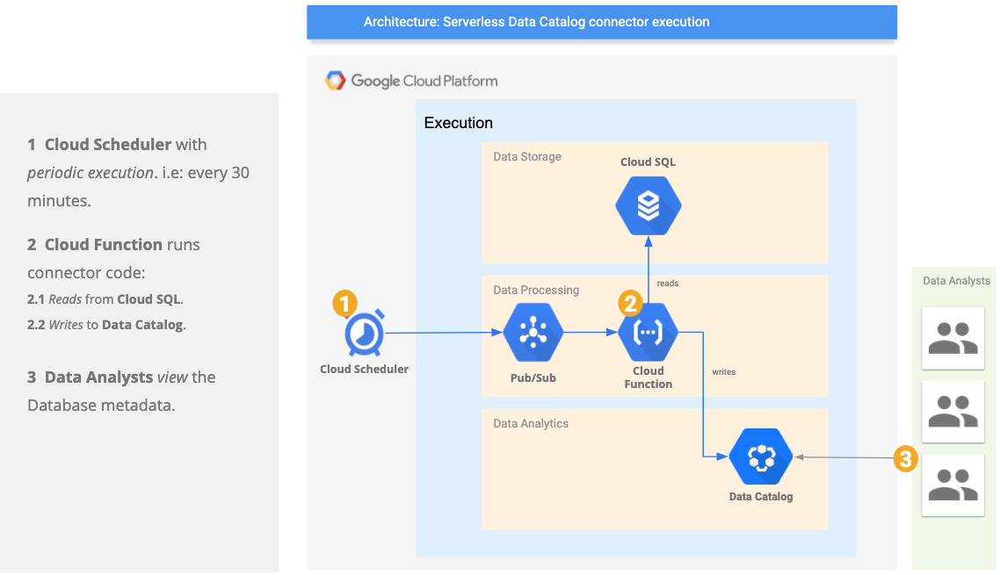

# DataCatalog PostgreSQL Connector Serverless.

[![License][1]][1] [![Issues][2]][3]

A package that shows how to set up the DataCatalog PostgreSQL connector in a serveless manner.

**Disclaimer: This is not an officially supported Google product.**

<!--
  ⚠️ DO NOT UPDATE THE TABLE OF CONTENTS MANUALLY ️️⚠️
  run `npx markdown-toc -i README.md`.

  Please stick to 80-character line wraps as much as you can.
-->



## Table of Contents

<!-- toc -->

- [1. Set up Infrastructure](#1-set-up-infrastructure)
  * [1.1 Get the code](#11-get-the-code)
  * [1.2. Create your DB secrets using secrets manager](#12-create-your-db-secrets-using-secrets-manager)
    + [1.2.1 Set environment variables](#121-set-environment-variables)
    + [1.2.2 Run script to create your db credentials secrets.](#122-run-script-to-create-your-db-credentials-secrets)
  * [1.3. Deploy Cloud Function and Cloud Scheduler](#13-deploy-cloud-function-and-cloud-scheduler)
    + [1.3.1 Set environment variables](#131-set-environment-variables)
    + [1.3.2 Run script](#132-run-script)
  * [1.4. Update the Cloud Function](#14-update-the-cloud-function)
    + [1.4.1 Set environment variables](#141-set-environment-variables)
    + [1.4.2 Run script](#142-run-script)

<!-- tocstop -->

-----

## 1. Set up Infrastructure

### 1.1 Get the code

````bash
git clone https://github.com/mesmacosta/google-datacatalog-postgresql-connector-serverless/
cd google-datacatalog-postgresql-connector-serverless
````
Run the following commands at the root of the google-datacatalog-postgresql-connector-serverless directory.

### 1.2. Create your DB secrets using secrets manager

#### 1.2.1 Set environment variables

Replace below values according to your environment:

```bash
export PROJECT_ID=$(gcloud config get-value project)
```

#### 1.2.2 Run script to create your db credentials secrets.
```bash
# Set up your credentials user
./create_secret.sh --value admin --name db_credentials_user
# Set up your credentials pass
./create_secret.sh --value admin123 --name db_credentials_pass
```

### 1.3. Deploy Cloud Function and Cloud Scheduler

#### 1.3.1 Set environment variables

Replace below values according to your environment:

```bash
export DATACATALOG_PROJECT_ID=$(gcloud config get-value project)
export DATACATALOG_LOCATION_ID=us-central1
export TOPIC_NAME=pubsub-postgresql-connector
# Format: https://cloud.google.com/scheduler/docs/configuring/cron-job-schedules
export CRON_SCHEDULE="30 * * * *"
export SA_NAME=sa-postgresql-connector
export DB_CREDENTIALS_USER_SECRET=db_credentials_user
export DB_CREDENTIALS_PASS_SECRET=db_credentials_pass
export POSTGRESQL_SERVER=30.200.40.200
export POSTGRES_DB=postgres
```

#### 1.3.2 Run script
```bash
./deploy.sh
```

### 1.4. Update the Cloud Function

#### 1.4.1 Set environment variables

Replace below values according to your environment:

```bash
export DATACATALOG_PROJECT_ID=$(gcloud config get-value project)
export DATACATALOG_LOCATION_ID=us-central1
export UPDATE_FUNCTION=true
export TOPIC_NAME=pubsub-postgresql-connector
export SA_NAME=sa-postgresql-connector
export DB_CREDENTIALS_USER_SECRET=db_credentials_user
export DB_CREDENTIALS_PASS_SECRET=db_credentials_pass
export POSTGRESQL_SERVER=30.200.40.200
export POSTGRES_DB=postgres
```

#### 1.4.2 Run script
```bash
./deploy.sh
```


[1]: https://img.shields.io/github/license/mesmacosta/google-datacatalog-postgresql-connector-serverless.svg
[2]: https://img.shields.io/github/issues/mesmacosta/google-datacatalog-postgresql-connector-serverless.svg
[3]: https://github.com/mesmacosta/google-datacatalog-postgresql-connector-serverless/issues
